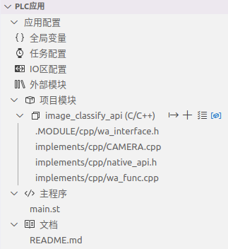
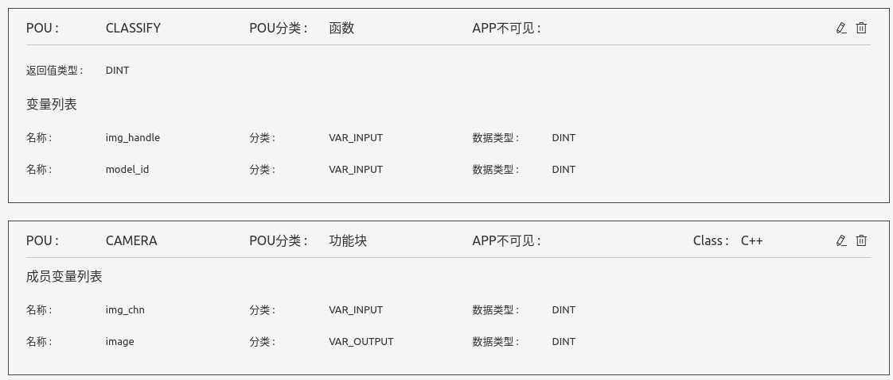
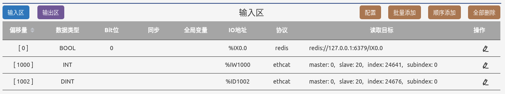
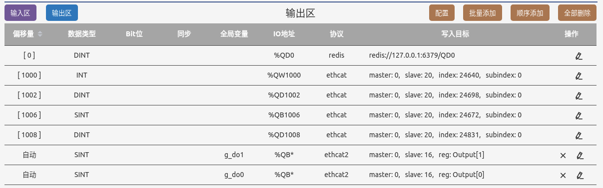

# WasomePLC Demo: 基于人工智能的图像分类与控制

## 场景

PLC应用实时识别摄像头采集到的图像，根据图像分类识别结果控制电机的运转行为和数字模块的输出。模拟智能分拣线的基本行为。

图像采集与图像分类功能使用C/C++编码实现，被封装成功能块和函数，提供给ST或者梯形图程序调用。

## 设备配置

- PLC主机上连接USB摄像头
- PLC主机通过etherCAT连接以下从站设备：
    - 汇川is620n伺服，从站地址为20
    - 成石创新ITEVGA ETHERCAT数字IO模块，从站地址为16。链接：http://tegva.cn/product/34.html

etherCAT从站的相关配置说明请参考教程示例7-3。

## 程序组成与设计

本演示包含如下主要组成软件：
- 工具程序[/Tools/capture_image.py](./Tools/capture_image.py)源码，其单独运行每100ms从摄像头采集一张图片，保存于磁盘目录/wa-plc/images下
- 集成了OPENVINO的PLC runtime (从厂家获取)
- PLC应用源码，其编译打包后运行于OPENVINO PLC runtime之上. 应用的项目组织结构如下图：  


## 基本工作原理

1. USB摄像头采集到的图像存储到磁盘目录/wa-plc/images下
2. ST程序通过调用封装的功能块CAMERA获取摄像头采集的最新图像文件内容
3. ST程序通过调用封装的函数CLASSIFY()来对图像进行分类
4. ST程序根据分类识别结果控制电机的运转参数以及IO输出状态


## 图像采集与分类算法的模块封装
### 模块接口定义
本项目包含一个内部模块`image_classify_api`，基于c/c++语言实现。模块定义了两个POU接口：
- CAMERA：功能块，每次调用采集一幅图象，
    - 输入参数`img_chn`：表示输入通道ID,每个通道在配置文件`image_classify.cfg`中定义。
    - 输出参数`image`：表示所采集到的图象句柄
- CLASSIFY：函数，对一幅图象进行分类识别
    - 输入参赛`img_handle`: 功能块CAMERA调用后所获取图象文件的句柄
    - 输入参数`model_id`: 所采用的人工智能模型ID。每个模型配置在配置文件`image_classify.cfg`中定义。

从模块接口编辑器中展示如下：  



### 模块的文件组织结构
```
~/plc-iot/demo-img-classify/MODULES$ tree -a
.
└── image_classify_api
    ├── implements
    │   └── cpp
    │       ├── CAMERA.cpp
    │       ├── native_api.h
    │       └── wa_func.cpp
    └── .MODULE
        ├── cpp
        │   └── wa_interface.h
        ├── excludes.WAEX
        └── interface.WAMOD
```
### Runtime提供的native接口

模块`image_classify_api`需要访问底层系统的能力来完成图象采集人工智能图象识别，PLC runtime提供的调用接口在[native_api.h](./MODULES/image_classify_api/implements/cpp/native_api.h)中描述：

```
__attribute__((import_module("openvino")))
__attribute__((import_name("plc_image_classify")))
int
plc_image_classify(int image_handle, int model_id);

__attribute__((import_module("openvino")))
__attribute__((import_name("plc_take_photo")))
int
plc_take_photo(int image_channel);
```
### 模块接口C头文件
用户在模块接口编辑器中定义了接口后，通过IDE自动创建框架代码，其中自动生成的头文件[wa_interface.h](./MODULES/image_classify_api/.MODULE/cpp/wa_interface.h)定义了用户需要实现的函数与C++类：

```
int CLASSIFY(int img_handle, int model_id);


/************* Function Block CAMERA *************/
#ifdef __cplusplus
extern "C" {
void __init_CAMERA(FBData *self);
}

class CAMERA : public IECFBBase {
    enum {
      LOC_img_chn,  // VAR_INPUT, int
      LOC_image,  // VAR_OUTPUT, int
    };

  private:
    CAMERA(const CAMERA &);
    CAMERA &operator=(const CAMERA &);

  private:
    int img_chn;
    int image;

  public:
    CAMERA();
    virtual ~CAMERA();
    virtual void call() override;

    const static int IEC_FIELD_CNT = 2;
};
```

### 模块接口的C/C++实现
函数`CLASSIFY`在源文件[wa_func.cpp](./MODULES/image_classify_api/implements/cpp/wa_func.cpp)中实现：
```
#include "../../.MODULE/cpp/wa_interface.h"
#include "native_api.h"

int CLASSIFY(int img_handle, int model_id) {
    return plc_image_classify(img_handle, model_id);
}

```

功能块`CAMERA`在源程序[CAMERA.cpp](./MODULES/image_classify_api/implements/cpp/CAMERA.cpp)中实现。源码中已经包含了自动生成的C++类的基本结构，用户只需要在有注释`/* USER CALL START */`的地方输入自己需要实现的逻辑。
```
void __init_CAMERA(FBData *self) { self->fb_self = new CAMERA(); }

const int CAMERA::IEC_FIELD_CNT;

CAMERA::CAMERA() {
    value_map_len = CAMERA::IEC_FIELD_CNT;

    value_addr_map_ =
        (void **)malloc(CAMERA::IEC_FIELD_CNT * sizeof(void *));
    value_addr_map_[LOC_img_chn] = &img_chn;
    value_addr_map_[LOC_image] = &image;

    value_bytes_map_ =
        (unsigned char *)malloc(CAMERA::IEC_FIELD_CNT);
    value_bytes_map_[LOC_img_chn] = sizeof(int);
    value_bytes_map_[LOC_image] = sizeof(int);

    /* USER CONSTRUCT START */

    /* USER CONSTRUCT END */
}

CAMERA::~CAMERA() {
    /* USER DESTRUCT START */

    /* USER DESTRUCT END */
}

void CAMERA::call() {
    /* USER CALL START */
    image = plc_take_photo(img_chn);
    /* USER CALL END */
}
```


## 图像分类的配置文件

runtime支持通过配置文件来设定图象采集通道与所使用的人工智能模型。PLC应用中需要提供配置文件：[CONFIG/resources/image_classify.cfg](./CONFIG/resources/image_classify.cfg)
```
{
    "device": "CPU",
    "images":
    [
        {
            "channel": 0,
            "path": "/wa-plc/images/photo.jpg"
        }
    ],
    "models":
    [
        {
            "id": 0,
            "name": "squeezenet1.1",
            "path": "../OpenVINO-model/squeezenet"
        }
    ]

}

```
- device是一个字符串，表示用于运算的设备，可以是"CPU"或"GPU"，
    - CPU：一般而言，选择CPU在大部分设备上可工作，但是处理速度相对较慢
    - GPU：需要确保安装了相应驱动，请参考OpenVINO官方文档安装设备对应的驱动
- images是一个数组，记录了每个图片通道的信息，其中：
    - channel为该通道的唯一标识，不可重复
    - path是该通道图片文件的存储路径（包含文件名）
- models是一个数组，记录了每个模型文件的信息，其中：
    - id为该模型的唯一标识，不可重复
    - name为该模型的名称（用于计算模型对应的文件名）
    - path是模型文件的路径（不包含文件名）

> 注：路径可以是`绝对路径`或者`相对路径`，如果使用相对路径，则其为相对该配置文件的路径，而不是相对可执行程序的路径。
> 注：openvino runtime发布时自带一个轻量的网络模型（squeezenet），若配置文件中未配置任何models，则自动使用自带的模型，且其id为0


## PLC主程序

PLC应用的主程序在ST源程序[main.st](./PROGRAM/main.st)中实现。

### 变量定义
```
    VAR
        Reg_6041_status AT %IW1000 : INT;
        Reg_6064_actual_pos AT %ID1002 : DINT;

        Reg_6040_control_word AT %QW1000 : INT;
        Reg_607a_target_pos AT %QD1002 : DINT;
        Reg_6060_modesel AT %QB1006 : SINT;
        Reg_60ff_target_vel AT %QD1008 : DINT;

        cnt : INT := 0;

        Last_6041_status : INT := -1;
        Last_6040_control_word : INT := -1;
    END_VAR

    VAR
        trigger AT %IX0 : BOOL;
        classify_output : DINT;
        img : DINT;
        prev : BOOL;
        cam : CAMERA;
    END_VAR

    VAR_OUTPUT
        res AT %QD0 : CATEGORY;
    END_VAR
```
### 伺服电机状态驱动
```

    IF Last_6041_status <> Reg_6041_status THEN
         WA_LOG('Reg_6041_status changed from %d (0X%X) to %d (0X%X),  act-pos=%d (0X%X)', 
            Last_6041_status, Last_6041_status, Reg_6041_status, Reg_6041_status, Reg_6064_actual_pos, Reg_6064_actual_pos);
            Last_6041_status := Reg_6041_status;
       
    END_IF;
     
    Reg_60ff_target_vel := 0;
    Reg_6040_control_word := 0;
    Reg_60ff_target_vel := 16#1000000 ;

    IF Reg_6041_status = 16#218 THEN
        Reg_6040_control_word := 16#0080;

    ELSIF (Reg_6041_status AND INT#16#004F) = INT#16#0040  THEN
        Reg_6040_control_word := 16#0006;

    ELSIF (Reg_6041_status AND 16#006F) = 16#0021  THEN
        Reg_6040_control_word := 16#0007;

    ELSIF (Reg_6041_status AND 16#006F) = 16#0023  THEN
        Reg_6060_modesel := 9;
        Reg_6040_control_word := 16#000F;

    ELSIF (Reg_6041_status AND 16#006F) = 16#0027  THEN
        Reg_60ff_target_vel := 16#1000000 ;
        Reg_6040_control_word := 16#001F;
    END_IF;
    

    IF Last_6040_control_word <>  Reg_6040_control_word THEN
    WA_LOG('Reg_6040_control_word changed from %d (0X%X) to %d (0X%X)', 
        Last_6040_control_word, Last_6040_control_word, Reg_6040_control_word, Reg_6040_control_word);
    WA_LOG('Reg_6060_modesel = %d (0X%X)', Reg_6060_modesel, Reg_6060_modesel);
    WA_LOG('Reg_60ff_target_vel = %d (0X%X) $n', Reg_60ff_target_vel, Reg_60ff_target_vel);

    Last_6040_control_word := Reg_6040_control_word;
        
    END_IF;
```

### 图像采集、分类识别与控制输出

```
    g_do0 := g_do0 +1;  // 产生在第一组DO指示灯闪烁的效果
     
    //IF NOT trigger THEN
    //    IF prev THEN
    cam(img_chn := 0);
    img := cam.image;
    classify_output := CLASSIFY(img_handle := img, model_id := 0);

    IF classify_output = 953 THEN
        res := CATEGORY#Pineapple;
        WA_LOG('The classification result is: [%s]', 'Pineapple');
    ELSIF classify_output = 954 THEN
        res := CATEGORY#Banana;

        //第二组DO的第一个引脚输出
        g_do1 := 1;
        Reg_60ff_target_vel := 16#1000000 ;
        WA_LOG('The classification result is: [%s]', 'Banana');
    ELSIF classify_output = 950 THEN
        res := CATEGORY#Orange;

        //第二组DO的第8个引脚输出
        g_do1 := 128;
        Reg_60ff_target_vel := 16#4000000 ;
        WA_LOG('The classification result is: [%s]', 'Orange');
    ELSE
        res := CATEGORY#Unknown;

        //第二组DO的第所有8个引脚输出
        g_do1 := 255;
        Reg_60ff_target_vel := 16#0000000;
        WA_LOG('The classification result is: [%s], label: %d', 'Unknown', classify_output);
    END_IF;
```

## IO内存映射配置
IO输入区：  



IO输出区：  
